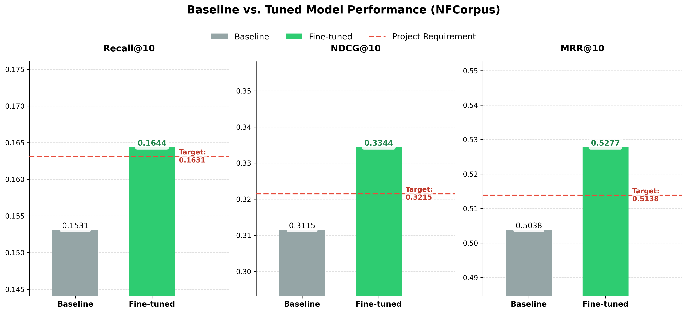

# Fine-tuning all-MiniLM-L6-v2 on NFCorpus

Recruitment task for the **LLM Applications** project — Cybertech Science Club, Wrocław University of Science and Technology.

---

## Project Overview

The goal of this task was to fine-tune the `all-MiniLM-L6-v2` embedding model on the NFCorpus medical dataset and measure the improvement in information retrieval quality across three metrics: **Recall@10**, **NDCG@10**, and **MRR@10**. The required improvement threshold was **+0.01** on each metric.

An embedding model converts text (queries and documents) into numerical vectors. The closer a query and its matching document are in vector space, the better the model understands their semantic relationship. Fine-tuning adapts a pre-trained model to a specific domain — in this case, medical texts — to improve retrieval quality.

---

## Dataset

**NFCorpus** is an information retrieval benchmark in the biomedical domain, built from two resources:

| Resource | Contents |
|---|---|
| `BeIR/nfcorpus` | ~3,600 medical documents (corpus) + queries |
| `BeIR/nfcorpus-qrels` | query → relevant document pairs (ground truth) |

---

## Methodology

### Loss Function — MultipleNegativesRankingLoss

For each (query, matching document) pair in a batch, all other documents in that batch are automatically treated as negative examples. The model learns to identify the correct document among all candidates in the batch — the larger the batch, the more negative candidates and the more effective the training signal.

### Training Configuration

| Parameter | Value | Rationale |
|---|---|---|
| Base model | `all-MiniLM-L6-v2` | Lightweight model (90 MB), strong pre-trained baseline |
| Loss function | `MultipleNegativesRankingLoss` | Contrastive learning with in-batch negatives |
| Epochs | 4 | Best checkpoint occurs at the end of epoch 3 |
| Batch size | 64 | Balance between number of in-batch negatives and memory usage |
| Learning rate | 1.5e-5 | Below default — conservative update of pre-trained weights |
| **Max seq length** | **256** | **Key change — default 128 was truncating medical documents** |
| Warmup | 10% of steps | Gradual LR ramp-up protects pre-trained weights at the start |
| `save_best_model` | `True` | Saves the best checkpoint, not the final epoch |
| `evaluation_steps` | 50 | Frequent evaluation to precisely capture the performance peak |
| `use_amp` | device-dependent | Enabled on CUDA, disabled on MPS and CPU |
| Seed | 42 | Set globally for reproducibility |

### Reproducibility

Seed 42 is set globally across `random`, `numpy`, `torch`, and `torch.mps` before any operation. Results may still vary slightly depending on hardware, operating system, and library versions — particularly between CUDA and MPS/CPU.

### Best Checkpoint

The model peaked at **step 720**, corresponding to the end of **epoch 3**. In epoch 4, all metrics began to decline — a clear sign of overfitting on the relatively small training set. The `save_best_model=True` option automatically preserved the checkpoint from step 720.

---

## Results



| Metric | Baseline | Fine-tuned | Change | Target | Status |
|---|---|---|---|---|---|
| Recall@10 | 0.1531 | 0.1644 | +0.0113 | +0.01 | ✅ |
| NDCG@10 | 0.3115 | 0.3344 | +0.0229 | +0.01 | ✅ |
| MRR@10 | 0.5038 | 0.5277 | +0.0239 | +0.01 | ✅ |

All three metrics exceeded the required improvement threshold of **+0.01**.

---

## Environment

### Hardware

| Component | Specification |
|---|---|
| Machine | MacBook Air |
| Chip | Apple M4 |
| RAM | 16 GB |
| CPU | 10-core |
| GPU | 10-core (MPS) |

### Software

| Library | Version |
|---|---|
| Python | 3.12.13 |
| torch | 2.10.0 |
| sentence-transformers | 5.3.0 |
| datasets | 4.8.2 |
| transformers | 5.3.0 |
| accelerate | 1.13.0 |
| numpy | 2.4.3 |

Full list of dependencies: [`requirements.txt`](requirements.txt)

---

## Repository Structure

```
.
├── main.py                        # Training and evaluation script
├── evaluation_results.txt         # Metrics summary before and after fine-tuning
├── requirements.txt               # Environment dependencies
├── assets/
│   └── performance_comparison.png
└── README.md
```

---

## Usage

```bash
pip install -r requirements.txt
python main.py
```

The script automatically detects the available device (CUDA → MPS → CPU), downloads the dataset, evaluates the baseline model, runs fine-tuning, and saves the best checkpoint to `tuned_model_nfcorpus/`.